<div align="center">


</div>

<div align="center">

[](https://readme-typing-svg.demolab.com)

</div>

<div align="center">

[](https://tejakumar02.github.io/Portfolio/)&nbsp;
[](mailto:jayaramteja3@gmail.com)&nbsp;
[](https://www.linkedin.com/in/teja-kumar-g-s-373b6733a/)


</div>

---

## ⚡ At a Glance

<div align="center">

| 🗂️ 90K+ Annotations | ⚡ 13+ FPS Inference | 🎯 mAP50: 0.92 | ⏱️ ~90% QC Time Saved |
|:-------------------:|:--------------------:|:--------------:|:---------------------:|
| Large-scale dataset curation | Real-time production pipeline | Industrial defect detection | Automated document QC |

</div>

---

## 🧠 Who Am I?

```json
{
  "name"       : "Teja Kumar G S",
  "role"       : "AI Engineer",
  "location"   : "Chennai, India",
  "focus"      : ["Computer Vision", "GenAI / LLMs", "Real-Time ML Systems"],
  "philosophy" : "I don't just run models — I build systems that run in the real world.",
  "impact" : {
    "annotations"     : "90K+",
    "inference_FPS"   : "13+",
    "defect_mAP50"    : 0.92,
    "QC_time_saved"   : "~90%"
  },
  "stack" : {
    "vision"  : ["YOLO", "OpenCV", "Centroid Tracking", "ROI Validation"],
    "genai"   : ["LangChain", "RAG", "Ollama", "Mistral", "LLaMA","MCP"],
    "ocr"     : ["PaddleOCR", "Tesseract", "PyMuPDF"],
    "deploy"  : ["Flask", "FastAPI", "Docker", "Air-gapped Systems"]
  }
}
```

> 🚀 I build **end-to-end AI systems** that go into production — not demos.
> From dataset curation → model training → real-time deployment → monitoring.

---

## 💼 Experience

### 🏭 AI Engineer Intern — Defect Scanner &nbsp;&nbsp; `Jul 2025 – Jan 2026`

> *Real-time industrial vision system deployed on the factory floor*

- 🎯 **YOLOv8 defect detection** on 17K+ images → **mAP50: 0.92**, **13+ FPS** in live production
- 🔩 **Spatial-temporal validation** (centroid tracking + ROI checks) → ~95% process compliance (~60 units/shift)
- 🚨 **Automated alert system** (tower lamp + buzzer) for real-time enforcement → reduced manual inspection by **~40%**
- 🐳 **Docker-ready Flask REST API** · Full pipeline: CVAT annotation (90K+) → training → deployment → monitoring

---

### 🧠 DL Engineer Intern — FDAI &nbsp;&nbsp; `Dec 2024 – Jun 2025`

> *Offline document intelligence for enterprise environments*

- 🔍 **RAG pipelines** with LangChain + ChromaDB + locally hosted LLMs (Ollama: Mistral, LLaMA)
- 📄 **Multimodal document understanding** — PaddleOCR + Tesseract + HuggingFace Transformers (text, tables, NER)
- 🔒 **Air-gapped on-premises deployment** — zero cloud dependency
- ⚙️ **FastAPI demo endpoints** exposing model capabilities for stakeholders

---

## 🚀 Projects

<table>
<tr>
<td width="50%" valign="top">

### 🏗️ Industrial Defect Detection System


Real-time **circlip miss-detection** for industrial assembly lines.

| Metric | Value |
|--------|-------|
| Model mAP50 | **0.92** |
| Inference Speed | **13+ FPS** |
| Process Compliance | **~95%** |
| Manual Effort Saved | **~40%** |

- Spatial + temporal validation (centroid tracking, ROI checks)
- Hardware alert integration (tower lamp + buzzer)
- CVAT annotation (90K+) → training → Docker → monitoring

</td>
<td width="50%" valign="top">

### 🧾 RAG-Powered Document Intelligence


End-to-end **offline document Q&A and summarization** — fully air-gapped.

| Feature | Detail |
|---------|--------|
| Deployment | Fully **air-gapped** |
| Retrieval | Semantic chunking + **ChromaDB** |
| Input | OCR → embeddings → vector store |
| Output | Structured Q&A + summarization |

- Prompt-engineered LLM workflows (Mistral, LLaMA)
- FastAPI endpoints; runs entirely on local hardware

📁 [View Repo →](https://github.com/Tejakumar02/RAG_System)

</td>
</tr>
<tr>
<td width="50%" valign="top">

### ⚙️ QC Workflow Automation


Batch PDF processing that **replaced an entire manual QC workflow**.

| Metric | Result |
|--------|--------|
| Batch Size | **50+ PDFs** per run |
| Fields Extracted | **35+ structured fields** |
| Output Format | Formatted **Excel reports** |
| Time Saved | **~90%** vs manual |

- Metadata-aware parsing with PyMuPDF
- Streamlit UI for non-technical QC teams

📁 [View Repo →](https://github.com/Tejakumar02/OCR)

</td>
<td width="50%" valign="top">

### 🔍 Automated Job Search System


Intelligent job discovery and filtering pipeline — end-to-end.

| Feature | Detail |
|---------|--------|
| Sources | Multi-platform scraping |
| Filtering | Role-based keyword ranking |
| Output | Structured tracking dashboard |
| Dedup | Cross-source deduplication |

- Automated search-to-ranked-shortlist pipeline
- Configurable role and keyword filters

📁 [View Repo →](https://github.com/Tejakumar02/Automated-Job-Search-System)

</td>
</tr>
</table>

---

## 🛠️ Tech Arsenal

<div align="center">

| Domain | Tools |
|--------|-------|
| **Languages & Dev** |      |
| **Computer Vision** |   `Centroid Tracking` `Temporal Validation` `ROI Extraction` `CVAT` |
| **GenAI / LLMs** |    `Mistral` `LLaMA` `RAG` `Prompt Engineering` |
| **OCR / NLP** |   `Embeddings` `Entity Recognition` `PyMuPDF` |
| **Vector DBs & Data** |  `Dataset Curation` `Data Augmentation` `90K+ Annotations` |
| **Deployment** |  `Real-Time Inference` `REST APIs` `Air-Gapped Systems` `On-Premises` |

</div>

---

## 📊 GitHub Stats

> ⚠️ **Stats not rendering?** The public `github-readme-stats.vercel.app` instance is shut down. Follow the **setup steps below** to make stats work reliably using GitHub Actions — takes ~5 minutes.

<div align="center">


&nbsp;&nbsp;


</div>

<div align="center">

[](https://streak-stats.demolab.com)

</div>


## 🤝 Open to Collaborate On

<div align="center">

&nbsp;
&nbsp;
&nbsp;
&nbsp;


</div>

---

<div align="center">

*"The goal isn't to run a model. The goal is to build a system that solves a real problem — reliably, at speed, in production."*

</div>

<div align="center">


</div>
